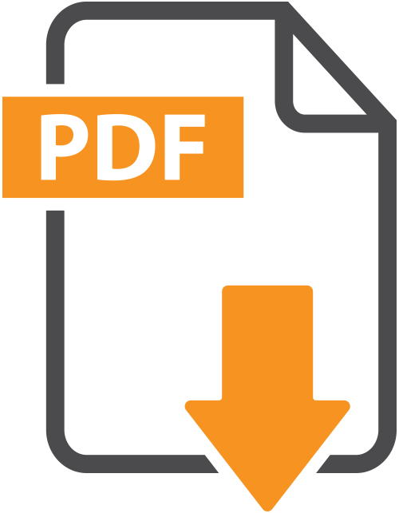

<h1> Logseq PDF Extract </h1>

## 🛠 Installation
Search for "PDF Extract" in the Logseq plugin store and install it. Or you could install it manually by downloading the latest release from [GitHub Releases](https://github.com/e-zz/logseq-pdf-extract/releases/latest).

If you are using this plugin for the first time, follow these steps after installation:
<details>
  <summary>❗ Enabling TeX OCR</summary>

- To use the OCR service from Hugging Face,

  1. Obtain a [Hugging Face API token](https://huggingface.co/settings/tokens)
  2. Paste your API key to the `HuggingFace User Access Token` field in the plugin settings.
- The API is free. But the service has a warm-up time. So the first OCR might take around 1 minute. After that, it should be fast.
</details>


<details>
  <summary>❗ To enable Zotero-related features </summary>

- On Zotero's side, it's necessary to install the latest version of [ZotServer](https://github.com/e-zz/ZotServer/releases/latest).
  - To learn how to install Zotero plugins, check [Zotero Documentation](https://www.zotero.org/support/plugins).
  - If ZotServer is successfully installed, open `http://localhost:23119/` in browser and you should see `No endpoint found`. 
  - Zotero must be open while using this feature.
</details>

If the `/Zotero` command is already working as expected, then you're good to go! 🎉 

**If the `/Zotero` command not working**:
<details>
  <summary> Please follow this to ensure PDFs <code>open</code> buttons work well! (Recommended)</summary>
  
> - Go to Logseq and find the Zotero integration settings. 
>   - See [Zotero Integration](https://docs.logseq.com/#/page/zotero) for more guidance.
>   - Your Zotero profiles, like `Zotero API key` and so on, are not accessible by plugins, which means they are not required for this plugin. Consequently, this plugin will never be affected by any modification in profiles.
> - To ensure the PDF `open` buttons work well and prevent Logseq from crashing, you must set up your Zotero profile with the paths outlined in the [Logseq Documentation](https://docs.logseq.com/#/page/658992ea-67b3-4a06-9c93-6fd3c58a3af9):
>   - `Zotero data directory` for imported PDF attachment 
>   - or `Linked Attachment Base Directory` for linked PDF attachment. 
</details>

## 🚀 A Quick Guide

###  1. Import Zotero Items  📚

This function serves as a local equivalent to Logseq's . For a comparison between this and Logseq's native `/Zotero` command, see [#6](https://github.com/e-zz/logseq-pdf-extract/discussions/6).

Currently, this plugin supports quick importing of items selected in Zotero or in a Zotero search panel. More features are planned (see [here](#possible-improvements) PRs are welcome). Also, Better BibTeX citation key can be imported. (Experimental. See [#alias_citationKey](#alias_citationkey-experimental) ).

- Import items selected in Zotero: 
  - Press `Ctrl+Alt+e` or type `/PDF: import selected Zotero items at cursor` 
  - Selected Zotero Items => Logseq pages
  - Use case: 
    - import items that have just been added to Zotero from browser via the Zotero Connector
    - import multiple items simultaneously
  - Option: turn off automatic insertion of PDF open buttons while importing. See [Settings](#settings) for more details.


- Show search panel: 
  - Press `Ctrl+Alt+z` or type `/PDF: show search panel`
  - Search items by titles (press `Enter` to execute a search).
  - Use mouse or arrow keys to scroll the results.
  - Press `Enter` or click to insert an item at cursor.
      - `ctrl+click` to insert multiple items
  - The items inserted will also be imported into Logseq if no duplicate page found (just like `/Zotero`).
  - And on showing up, by default it will list items selected in Zotero.  (But this does not work at the first run after Logseq is opened or refreshed. See [Known Issues](#known-issues))


> ❗ Search panel hasn't been thoroughly tested. Please use `ctrl+z` to undo if something goes wrong.

> About importing notes: 
> Not currently planned. But PRs are welcome.

### 2. Annotation Extraction 📝
For any highlight, this feature replaces `((uuid))` with its linked content (wrapped by a customizable template). For area highlights, $\LaTeX$ OCR are performed first and taken as the contents(Experimental). It supports batch extraction.

- The default shortcut is `Ctrl+Alt+i`, which converts all `((uuid))` links in block at cursor or selected blocks.

- Templates for inserting text and TeX:
  - [Template for Annotation Excerpts](#excerpt_style-template-for-annotation-excerpts) 
  - [Template for TeX OCR](#area_style-template-for-inserting-tex) 
- Use case:
  - When editing in an external application, the references to highlights are just `((uuid))`. 
  - A reference `((uuid))` might be broken unnoticeably. Most of the time, it's recoverable by searching the UUID in the graph folder. But sometimes, the content could be lost forever. So it's safer to keep both the content as well as the link to it.
  - Automatically store the OCR results for later use. 
  - Incremental reading of PDFs. Logseq supports drag and drop text from PDFs. But this way the link to the original highlight is lost.  

      
#### Text Highlights from PDF 
Here we explain what happens when you use `Ctrl+Alt+i` to convert `((uuid))` links in a block.

In the default case, 
``` 
- ((uuid))
```
will be converted to
```
- pdf-ref:: ((uuid))
  > The original content of ((uuid)) 
```
- `pdf-ref` is always displayed in just one line. This is to avoid showing the same text again.
- The name of the property `pdf-ref` is customizable in settings.
- The template for inserting text is customizable in settings: [Template for Annotation Excerpts](#excerpt_style-template-for-annotation-excerpts).

#### Area Highlights from PDF 
This plugin also helps to extract TeX formula from area highlights. The OCR service is provided by [Hugging Face](https://huggingface.co/). The OCR model is [Norm/nougat-latex-base](https://huggingface.co/Norm/nougat-latex-base). 

Two ways to invoke OCR: 
- Button: `copy as TeX` on the area highlight picture. The TeX formula will be copied to clipboard.

  

- Shortcut: `Ctrl+Alt+i`. The same key also works for text highlight extraction. But here a TeX string will be inserted into the block. 
  - A template is provided to customize the style of the inserted TeX: [Template for TeX OCR](#area_style-template-for-inserting-tex).

<details>
  <summary> A block property <code>ocr::</code>  will be added to the area highlight block</summary>

- In <code>hl__xxx</code> pages, you might see something like this after OCR: 
<br>


- This is to avoid processing the same picture again. To force a reprocess, please delete the <code>ocr::</code> property and then invoke the OCR function.
</details>

<details>
  <summary><h3>3. Open PDF from Any Path (under development 🚧)</h3></summary>

With [Zotero integration](https://docs.logseq.com/#/page/zotero) enabled, we could open PDFs under `Zotero linked attachment base directory` even if it's not in the assets folder. Logesq provides a macro `{{zotero-linked-file your_pdf_path}}` which is rendered as a button.
<br>

<br>

Here is how we could take advantage of it:
- (One-time setting) If you're using this plugin for the first time, you'll need to set the `PDF Root` in the plugin settings. This should be the path to your `Zotero linked attachment base directory`. To do this, navigate to the plugin settings, find the `PDF Root` field, and paste your path into this field.
- Copy the path to any PDF under the path `Zotero linked attachment base directory`
- In Logseq, use the slash command `/PDF: insert button from copied PDF`

> **Caution!** Buttons are delicate. If Logseq cannot find a PDF specified by the button, it may crash (possible data loss). Dynamical update might be implemented in the future. But no easy solutions so far. One idea is to record Zotero item key to update the button from Zotero. PRs or ideas are welcome.

<details>
  <summary>How it works and when I use it.</summary>
> Personally, I love this hack because by creating mutli-profiles, in principle we could open any PDFs no matter where it's located on your PC. For example, we could insert buttons as "bookmarks" linked to any PDF without importing them. However, this feature depends on the enhancements to the multi-profile feature, as proposed in [this PR](https://github.com/logseq/logseq/pull/10430). Without it, it's better to ignore this function. 
>
> Maybe with more Logseq API published in future, we could create various buttons, such as a button that links to a specific page of a PDF, or even "non-highlight" button that eliminates the need for highlighting. And if you have any ideas, PRs are welcome.
</details>
</details>

## ⚙ 2. Settings
#### `insert_button`: insert PDF open button when importing Zotero items
If enabled, when importing Zotero items, the plugin will insert a PDF open button if the item has a PDF attachment. Notice that it will insert multiple buttons if more than one PDF attachment is found.

If you don't want this behavior, tick it off. 

#### `alias_citationKey` (Experimental)
It's quite common to use [Better BibTeX](https://github.com/retorquere/zotero-better-bibtex/) to manage BibTeX keys in Zotero. 

If this option is on, the citation key will be used as the `alias` property of an item page.  (Inspired by [sawhney17/logseq-citation-manager](https://github.com/sawhney17/logseq-citation-manager))
> For example, if the citation key is `Smith2021`, then the item page will have property `alias:: [[Smith2021]]`. Also, the item will be inserted as `[[Smith2021]]` at cursor, instead of the full title.

#### `excerpt_style`: Template for Annotation Excerpts
This template defines the style of the inserted text. In the template, `{{excerpt}}` is provided as a placeholder, which will be replaced by the excerpt. The default template is
``` 
> {{excerpt}}
```

#### `area_style`: Template for Inserting TeX 
When inserting TeX, one could customize the style by a template. In the template, two placeholders are provided: `uuid` and `tex`, which will be replaced by the UUID of the area highlight and the TeX respectively. The default template is
```
((uuid))\n$$tex$$
```
> For example, if you need to replace the original area highlights with TeX, then use `$$tex$$` as the template. More complex template with hiccup syntax should be possible, but I haven't tested it.

# Possible Improvements

Import as Logseq pages:
- [ ] PDF items (PDF without a parent item)

Import at cursor:
- [ ] Import specific attachment as a button

Search Panel:
  - [ ] UI: allow users to select attachments
  - [ ] UI: show recent items in Zotero

Search Syntax:
  - [ ] ❓ support additional [Zotero search features](https://www.zotero.org/support/dev/client_coding/javascript_api)
    - [Zotero search fields](https://www.zotero.org/support/dev/client_coding/javascript_api/search_fields)
    - [Zotero search syntax](https://github.com/zotero/zotero/blob/b31f66ddbdc59cdf97966a392f510ed0afff706f/chrome/content/zotero/xpcom/data/searchConditions.js)

---
Proof of concept:
- [ ] ❓ Full-text search across PDFs and open matched pages in Logseq
- [ ] ❓ two-way sync: tags, title, etc.
- [ ] ❓ support Zotero search syntax
- [ ] ❓ show recent PDF files opened in Logseq. (Not sure if it's possible.)

--- Not planned yet
- [ ] Notes and two-way sync
- [ ] Item page customization: e.g., Org-mode support

# Known Issues

- [ ] The first time you use the search box, it will not show what has been selected in Zotero. A workaround is to open the search box twice.
- [ ] Occasionally the arrow keys don't work in the search box. A workaround is to use the mouse. It should be fixed after Logseq restarts or refreshes.

# Acknowledgements
TeX OCR
- olmobaldoni: [logseq-formula-ocr-plugin](https://github.com/olmobaldoni/logseq-formula-ocr-plugin)
- NormXU: [nougat-latex-ocr](https://github.com/NormXU/nougat-latex-ocr)
- Hugging Face: [Norm/nougat-latex-base](https://huggingface.co/Norm/nougat-latex-base)

Zotero API 
- Zotero: [Zotero API](https://www.zotero.org/support/dev/web_api/v3/start)
- MunGell: [ZotServer](https://github.com/MunGell/ZotServer)
- cboulanger: [excite-docker](https://github.com/cboulanger/excite-docker)

Icon
- Microsoft Bing: [Designer](https://www.bing.com/images/create/)

Search Panel GUI
- xyhp915: [logseq-assets-plus](https://github.com/xyhp915/logseq-assets-plus)

Coding Assistance
- GitHub Copilot


# Support
Find this plugin useful? [Buy me a coffee](https://www.buymeacoffee.com/e.zz) ☕️ or you could support my favorite Logseq plugins and their developers. It's also a great help for me. 
- [debanjandhar12/logseq-anki-sync](https://github.com/debanjandhar12/logseq-anki-sync): I love its idea of keeping links to Logseq blocks in Anki cards. It has significantly enhanced my experience of reviewing and updating cards on Anki mobile.
-  [haydenull/logseq-plugin-agenda](https://github.com/haydenull/logseq-plugin-agenda): a game changer for task management.

Both projects are not only feature-rich but also continue to evolve through active development.

# Development

- Install dependencies with `npm install`
- Build the application using `npm run build` or `npm run watch`
- Load the plugin in the Logseq Desktop client using the `Load unpacked plugin` option.

> ❗ **Notice:** Unfortunately, the dependency `vue-virtual-scroller` does not work well with `vite run --watch` or `npm run watch` in the `package.json`. Use `npm run build` instead. Please help if you know how to fix it.
