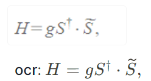
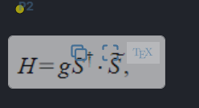
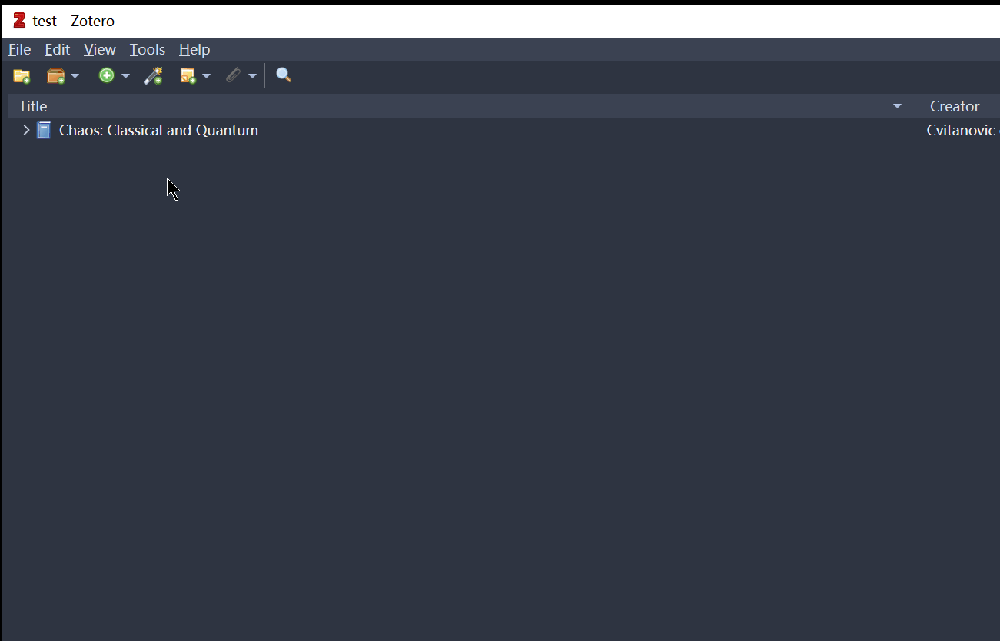
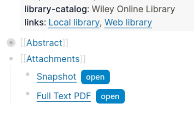

# PDF Extract
## A Quick Guide
### Annotation Extraction
Use `Ctrl+Alt+i` to get the original text of the reference to annotation block. A template is provided to customize the style of the inserted text. See [Template for Annotation Excerpts](#excerpt_style-template-for-annotation-excerpts) for more details.

<!-- TODO explain the pdf-ref property -->

### TeX OCR of Area Highlights
Inspired by [logseq-formula-ocr-plugin](https://github.com/olmobaldoni/logseq-formula-ocr-plugin), this plugin helps to extract TeX from area highlights.

> ❗ **For new users: API token** The OCR service from Hugging Face is used.
> 1. Get a [Hugging Face API token](https://huggingface.co/settings/tokens)
> 2. In the plugin settings, paste your API key to the `HuggingFace User Access Token` field.
> 
> Notice that the free quota of the OCR service is not quite clear to me (please tell me if you know the number). For more info, see [Hugging Face - Documentation - huggingface.co/](https://huggingface.co/docs).

Notice the plugin modifies `hl__xxx` pages. A block property `ocr::`  will be added to the area highlight block, as shown below. This is to avoid repeated OCR of the same area highlight. If you want to re-OCR an area highlight, just delete the `ocr::` property.




Two ways are provided to extract TeX from area highlights: button and shortcut.
#### Button: Copy TeX to clipboard
On the area highlights, a button named `copy as TeX` is provided to copy TeX to clipboard.  



#### Shortcut: Insert TeX into the Block
Use `Ctrl+Alt+i` to insert TeX string into the block. A template is provided to customize the style of the inserted TeX. See [Template for TeX OCR](#area_style-template-for-inserting-tex) for more details.


### Extract Zotero Items  (Experimental)
 This function mimics Logseq's `/Zotero` command, but it's fully local.

> ❗ **Requirement:** To use it, you need to install [ZotServer](https://github.com/e-zz/ZotServer/releases) plugin in Zotero. No extra configuration is needed. After installation, open `http://localhost:23119/` in your browser. If you see `No endpoint found`, then it's working. Also, keep Zotero open while importing.

#### Import items already selected in Zotero 
Use `Ctrl+Alt+e` to import items selected in Zotero. The items will be imported as Logseq pages.



- [x] Attachments in Zotero storage 
- [x] Linked files
- [x] Option: turn off the automatic insertion of PDF open buttons while importing
- [x] Slash command: `/PDF Extract: import items selected in Zotero`

#### Show Recent Items in Zotero
To be implemented

#### Search Box 
To be implemented

#### Notes
Not in plan yet. But PRs are welcome.

### PDF Open Button (Experimental)
With [Zotero integration](https://docs.logseq.com/#/page/zotero) enalbed, we could open PDFs under `Zotero linked attachment base directory` even if it's not in the assets folder. Logesq provides a macro `{{zotero-linked-file your_pdf_path}}` which is rendered as a button.


Here is how we could take advantage of it:
- (One-time setting) If you're using this plugin for the first time, you'll need to set the `PDF Root` in the plugin settings. This should be the path to your `Zotero linked attachment base directory`. To do this, navigate to the plugin settings, find the `PDF Root` field, and paste your path into this field.
- Copy the path to any PDF under the path `Zotero linked attachment base directory`
- In Logseq, use the slash command `/PDF: insert button from copied PDF`

> **Caution!** Buttons are delicate. If Logseq cannot find a PDF specified by the button, it may crash (possible data loss). Dynamical update might be implemented in the future. But no easy solutions so far. One idea is to record Zotero item key to update the button from Zotero. PRs or ideas are welcome.

> **How it works and when to use it.**
Personally, I love this hack because in principle by creating mutli-profiles, we could open any PDFs no matter where it's located on your PC. For example, we could insert buttons as "bookmarks" linked to any PDF without importing them. But this feature relies on [this PR](https://github.com/logseq/logseq/pull/10430). Till now, this function can only be used as an alternative to copy a button that already exists in Zotero item page `@xxx` by hands.
>
> And maybe with more Logseq API published in future, we could create various buttons, such as a button that links to a specific page of a PDF. This would be useful for note-taking or tracking the reading progress.

## Settings
#### `excerpt_style`: Template for Annotation Excerpts
This template defines the style of the inserted text. In the template, `{{excerpt}}` is provided as a placeholder, which will be replaced by the excerpt. The default template is
``` 
> {{excerpt}}
```

#### `area_style`: Template for Inserting TeX 
When inserting TeX, one could customize the style by a template. In the template, two placeholders are provided: `uuid` and `tex`, which will be replaced by the UUID of the area highlight and the TeX respectively. The default template is
```
((uuid))\n$$tex$$
```
> For example, if you need to replace the original area highlights with TeX, then use `$$tex$$` as the template. More complex template with hiccup syntax should be possible, but I haven't tested it.

# Acknowledgements
TeX OCR
- olmobaldoni: [logseq-formula-ocr-plugin](https://github.com/olmobaldoni/logseq-formula-ocr-plugin)
- NormXU: [nougat-latex-ocr](https://github.com/NormXU/nougat-latex-ocr)
- Hugging Face: [Norm/nougat-latex-base](https://huggingface.co/Norm/nougat-latex-base)

Zotero API 
- Zotero: [Zotero API](https://www.zotero.org/support/dev/web_api/v3/start)
- MunGell: [ZotServer](https://github.com/MunGell/ZotServer)
- cboulanger: [excite-docker](https://github.com/cboulanger/excite-docker)

Icon
- Mcrosoft Bing: [Designer](https://www.bing.com/images/create/)

Coding Assistance
- GitHub Copilot


# Support
Find this plugin useful? [Buy me a coffee](https://www.buymeacoffee.com/e.zz) ☕️ or you could support my favorite Logseq plugins and their developers. It's also a great help for me. 
- [debanjandhar12/logseq-anki-sync](https://github.com/debanjandhar12/logseq-anki-sync): I love its idea of keeping links to Logseq blocks in Anki cards. It has significantly enhanced my experience of reviewing and updating cards on Anki mobile.
-  [haydenull/logseq-plugin-agenda](https://github.com/haydenull/logseq-plugin-agenda): a game changer for task management.

Both projects are not only feature-rich but also continue to evolve through active development.

# Development

- Install dependencies with `npm install`
- Build the application using `npm run build` or `npm run watch`
- Load the plugin in the Logseq Desktop client using the `Load unpacked plugin` option.
