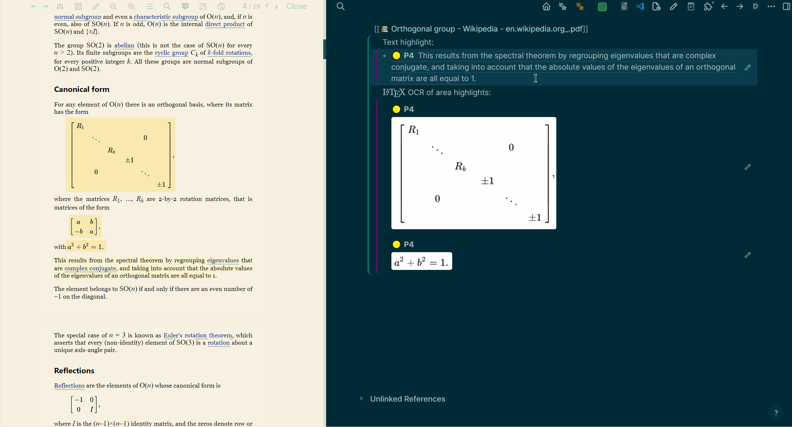

<h1> Logseq PDF Extract </h1>

A plugin for improving PDF workflow in Logseq. It now mainly features:

-   [Importing Zotero items](#1-import-zotero-items--)
-   [Post-processing (text extraction or OCR)](#2-annotation-extraction-) of PDF highlights made with Logseq

And [more features](#possible-improvements) are planned. PRs are welcome!

## 🛠 Installation

Search for "PDF Extract" in the Logseq plugin store and install it. Or you could install it manually by downloading the latest release from [GitHub Releases](https://github.com/e-zz/logseq-pdf-extract/releases/latest).

If you are using this plugin for the first time, follow these steps after installation:

<details>
  <summary>⚙ To enable TeX OCR of area highlights</summary>

-   To use the OCR service from Hugging Face,

    1. Obtain a [Hugging Face API token](https://huggingface.co/settings/tokens)
    2. Paste your API key to the `HuggingFace User Access Token` field in the plugin settings.

-   The API is free. But the service has a warm-up time. So the first OCR might take around 1 minute. After that, it should be fast.
</details>

<details>
  <summary>⚙ To enable Zotero-related features </summary>
<b>For Zotero 7:</b> make sure Zotero is running and turn on <b>For Zotero 7:</b> make sure Zotero is running and turn on <code>Edit -> Settings -> Advanced -> Allow other applications on this computer to communicate with Zotero</code>.

<hr>
<b>For Zotero 6:</b> make sure Zotero is running and the plugin ZotServer is successfully installed in Zotero following the steps below:

-   Follow the [Installation instruction of ZotServer](https://github.com/e-zz/ZotServer?tab=readme-ov-file#installation)
-   If successfully installed, open `http://localhost:23119/` in browser and you should see `No endpoint found`

Now you can import stuff by using the slash command `/PDF: show search panel` or pressing `Ctrl+Alt+z`. The shortcut only works in editing mode.

<hr>

</details>


Also, to view PDFs imported from Zotero, it's better to specify these two paths in your settings:

<details>
  <summary>⚙ Two things possibly required by PDF "open" buttons: </summary>
  
> - Go to Logseq's [Zotero settings](https://docs.logseq.com/#/page/zotero) in menu.
> - Fill in below paths by your needs (as outlined in the [Logseq Documentation](https://docs.logseq.com/#/page/658992ea-67b3-4a06-9c93-6fd3c58a3af9)):
>    - `Zotero data directory` for imported PDF attachment 
>    - or `Linked Attachment Base Directory` for linked PDF attachment.

<b>Explanation:</b> They tell Logseq where to look for those PDFs managed by Zotero. Otherwise, Logseq might crash when you click a PDF `open` button. A PDF file not in the graph folder is still a nightmare for Logseq. For the detailed mechanism, see my explanation in [this PR](https://github.com/logseq/logseq/pull/10430#issue-1967091728).

</details>

And that's all for it! 🎉

## 🚀 A Quick Guide

### 1. Import Zotero Items 📚 

For a comparison between this and Logseq's native `/Zotero` command, see [#6](https://github.com/e-zz/logseq-pdf-extract/discussions/6).

Currently, this plugin supports quick importing of **items selected in Zotero** or importing by **searching items in a popup panel**, as shown below. [More features are planned](#possible-improvements) and PRs welcome. If Better BibTeX enabled in Zotero, citation keys can also be imported. (See [alias citationKey](#alias_citationkey-experimental) for more details. This is an experimental feature.).

#### 1.1 **Import items selected in Zotero** (Zotero 6 only)


-   Press `Ctrl+Alt+e` or type `/PDF: import selected Zotero items at cursor`
-   Selected Zotero Items => Logseq pages
-   Use case:
    -   import items that have just been added to Zotero from browser via the Zotero Connector
    -   import multiple items simultaneously
-   Option: turn off automatic insertion of PDF open buttons while importing. See [Settings](#settings) for more details.

---

#### 1.2 **Search panel**:


-   Press `Ctrl+Alt+z` or type `/PDF: show search panel`
    -   Search items by titles (press `Enter` to execute a search).
    -   Use mouse or arrow keys to scroll the results.
    -   Press `Enter` or click to insert an item at cursor.
    -   `ctrl+click` to insert multiple items

The items page will be created in the above process. But it will be aborted if the page `@{original-title}.md` already exists. By default, the panel will be initialized with the items being selected in Zotero. And the search panel is responsive. It will request Zotero automatically after you stop typing for a while (customize the `search_delay` in [Settings](#search_delay)). And it matches any part (or combination) of the following (according to [Zotero's documentation](https://www.zotero.org/support/searching))

-   Full text of PDF attachments
-   All metadata, including:
    -   titles
    -   tags
    -   notes
    -   BibTeX keys
    -   dates
    -   authors, etc.

Some examples are

-   `John 2022 Simulation` will (very likely) match the item authored by John in 2022 with the title (or main text) containing `Simulation`.
-   `john2022` will (very likely) match the item with the BibTeX key `john2022`.

### 2. Annotation Extraction 📝

For any highlight, this feature replaces `((uuid))` with its linked content (wrapped by a customizable template). For area highlights, $\LaTeX$ OCR are performed first and taken as the contents(Experimental). It supports batch extraction.



-   The default shortcut is `Ctrl+Alt+i`, which converts all `((uuid))` links in block at cursor or selected blocks.
-   Use case:
    -   When editing in an external application, the references to highlights are just `((uuid))`.
    -   A reference `((uuid))` might be broken unnoticeably. Most of the time, it's recoverable by searching the UUID in the graph folder. But sometimes, the content could be lost forever. So it's safer to keep both the content as well as the link to it.
    -   Automatically store the OCR results for later use.
    -   Incremental reading of PDFs. Logseq supports drag and drop text from PDFs. But this way the link to the original highlight is lost.
-   Templates for inserting text and TeX:
    -   [Template for Annotation Excerpts](#excerpt_style-template-for-annotation-excerpts)
    -   [Template for TeX OCR](#area_style-template-for-inserting-tex)

<blockquote>
<details> <summary><bold>Text Highlights from PDF</bold></summary>
Here we explain what happens when you use `Ctrl+Alt+i` to convert `((uuid))` links in a block.

In the default case,

```
- ((uuid))
```

will be converted to

```
- pdf-ref:: ((uuid))
  > The original content of ((uuid))
```

-   `pdf-ref` is always displayed in just one line. This is to avoid showing the same text again.
-   The name of the property `pdf-ref` is customizable in settings.
-   The template for inserting text is customizable in settings: [Template for Annotation Excerpts](#excerpt_style-template-for-annotation-excerpts).
</details>

<details>
<summary><bold>Area Highlights from PDF</bold></summary>

It's possible to extract TeX formula from area highlights. The OCR service is provided by [Hugging Face](https://huggingface.co/). The OCR model is [Norm/nougat-latex-base](https://huggingface.co/Norm/nougat-latex-base).

Two ways to invoke OCR:

-   Button: `copy as TeX` on the area highlight picture. The TeX formula will be copied to clipboard.

    

-   Shortcut: `Ctrl+Alt+i`. The same key also works for text highlight extraction. But here a TeX string will be inserted into the block.

    -   A template is provided to customize the style of the inserted TeX: [Template for TeX OCR](#area_style-template-for-inserting-tex).
    <blockquote>
     <details>
      <summary> A block property <code>ocr::</code>  will be added to the area highlight block</summary>

-   In <code>hl\_\_xxx</code> pages, you might see something like this after OCR:
    <br>
    

-   This is to avoid processing the same picture again. To force a reprocess, please delete the <code>ocr::</code> property and then invoke the OCR function.
</details>
</blockquote>
</details>
</blockquote>
<br>
<details>
  <summary><h3>3. Open PDF from Any Path (under development 🚧)</h3></summary>

With [Zotero integration](https://docs.logseq.com/#/page/zotero) enabled, we could open PDFs under `Zotero linked attachment base directory` even if it's not in the assets folder. Logesq provides a macro `{{zotero-linked-file your_pdf_path}}` which is rendered as a button.
<br>

<br>

Here is how we could take advantage of it:

-   (One-time setting) If you're using this plugin for the first time, you'll need to set the `PDF Root` in the plugin settings. This should be the path to your `Zotero linked attachment base directory`. To do this, navigate to the plugin settings, find the `PDF Root` field, and paste your path into this field.
-   Copy the path to any PDF under the path `Zotero linked attachment base directory`
-   In Logseq, use the slash command `/PDF: insert button from copied PDF`

> **Caution!** Buttons are delicate. If Logseq cannot find a PDF specified by the button, it may crash (possible data loss). Dynamical update might be implemented in the future. But no easy solutions so far. One idea is to record Zotero item key to update the button from Zotero. PRs or ideas are welcome.

<details>
  <summary>How it works and when I use it.</summary>
> Personally, I love this hack because by creating mutli-profiles, in principle we could open any PDFs no matter where it's located on your PC. For example, we could insert buttons as "bookmarks" linked to any PDF without importing them. However, this feature depends on the enhancements to the multi-profile feature, as proposed in [this PR](https://github.com/logseq/logseq/pull/10430). Without it, it's better to ignore this function. 
>
> Maybe with more Logseq API published in future, we could create various buttons, such as a button that links to a specific page of a PDF, or even "non-highlight" button that eliminates the need for highlighting. And if you have any ideas, PRs are welcome.
</details>
</details>

## ⚙ Settings
#### `Zotero version`
Select between `Zotero 6` or `Zotero 7`. Reload plugin or graph to take effect.

Zotero 7 support is requested by https://github.com/e-zz/logseq-pdf-extract/issues/18 and https://github.com/e-zz/logseq-pdf-extract/issues/15 

#### `search_delay`

The default delay between user's input and search is 100ms.

> To optimize the performance and avoid unnecessary queries by the responsive search panel, we add some delay between user's input and queries. It forces to wait for a specified duration after the user stops typing in the search box before initiating a new search in Zotero. This delay ensures that the system doesn't trigger a search with every keystroke, thereby reducing unnecessary load. However, if your Zotero library has a relatively small number of items, you're welcome to reduce the delay duration as much as you like.

#### `insert_button`: insert PDF open button when importing Zotero items

Turn this on and you'll get a button to open a PDF every time you import an item from Zotero that has a PDF attached. If an item has more than one PDF, you'll get more than one button.

#### `alias_citationKey` (Experimental)

Lots of people use [Better BibTeX](https://github.com/retorquere/zotero-better-bibtex/) to handle BibTeX keys in Zotero.

If you turn this on, the citation key will be used as the `alias` for an item page. This idea came from [sawhney17/logseq-citation-manager](https://github.com/sawhney17/logseq-citation-manager).

> For example, if the citation key is `Smith2021`, then the item page will have `alias:: [[Smith2021]]`. Also, the item will be inserted as `[[Smith2021]]` at cursor, instead of the full title.

#### Template for Zotero items
The template specifying how entries should be imported at cursor.
See the [template](https://github.com/e-zz/logseq-pdf-extract/wiki/Template-for-the-%60import-at-cursor%60-function) for more details.


#### `unwanted_keys`

A list of item page property keys that you don't want to import. For example, if you don't want to import `original-title`, then add `original-title` to the list. Separate keys with commas or newlines, like this:

```
original-title, date,
item-type

```
This is requested by https://github.com/e-zz/logseq-pdf-extract/issues/8#issuecomment-1900524449 

#### Enable the Zotero-style title
Follow the Zotero File naming style for pages created by importing from Zotero. For customization, you need to configure in Zotero. See the [Zotero tutorial](https://www.zotero.org/support/file_renaming).

This is a workaround for https://github.com/e-zz/logseq-pdf-extract/discussions/12 

#### `excerpt_style`: Template for Annotation Excerpts

This is where you decide how the inserted text should look. Use `{{excerpt}}` as a placeholder, which will be replaced by the excerpt. By default, it looks like this:

```
> {{excerpt}}
```

#### `area_style`: Template for Inserting TeX

When inserting TeX, one could also customize the style by a template. In the template, two placeholders are provided: `uuid` and `tex`, which will be replaced by the UUID of the area highlight and the TeX respectively. The default template is

```
((uuid))\n$$tex$$
```

> For example, use `$$tex$$` as the template and the original area highlights will be replaced by LaTeX OCR results.
> More complex template using hiccup syntax might be possible, but I haven't tested it.

# Possible Improvements

Import as Logseq pages:

-   [ ] PDF items (PDF without a parent item)
-   [ ] Item page customization: e.g., Org-mode support, [page template](https://github.com/e-zz/logseq-pdf-extract/discussions/10) and so on.
        Import at cursor:
-   [ ] Import specific attachment as a button

Search Panel:

-   [ ] UI: allow users to select attachments
-   [ ] UI: show recent items in Zotero

Search Syntax:

-   [ ] ❓ support additional [Zotero search features](https://www.zotero.org/support/dev/client_coding/javascript_api)
    -   [Zotero search fields](https://www.zotero.org/support/dev/client_coding/javascript_api/search_fields)
    -   [Zotero search syntax](https://github.com/zotero/zotero/blob/b31f66ddbdc59cdf97966a392f510ed0afff706f/chrome/content/zotero/xpcom/data/searchConditions.js)

---

Proof of concept:

-   [ ] ❓ Full-text search across PDFs and open matched pages in Logseq (check [the discussion](https://github.com/e-zz/logseq-pdf-extract/discussions/11) and vote for the relevant [Feature Request here](https://discuss.logseq.com/t/plugin-api-open-a-pdf-by-its-path-which-might-enable-full-text-search-across-pdfs/25199)!)
-   [ ] ❓ two-way sync: tags, title, etc.
-   [ ] ❓ support Zotero search syntax
-   [ ] ❓ show recent PDF files opened in Logseq. (Not sure if it's possible.)

---

Not planned yet

-   [ ] Notes and two-way sync
-   [ ] Import PDF highlights made with other tools (Check the script [LogseqPDFImporter](https://github.com/thiswillbeyourgithub/LogseqPDFImporter) instead)

# Known Issues

-   [ ] The first time you use the search box, it will not show what has been selected in Zotero. A workaround is to open the search box twice.
-   [ ] Occasionally the arrow keys don't work in the search box. A workaround is to use the mouse. It should be fixed after Logseq restarts or refreshes.

# Q & A

### How is this different from Logseq's native `/Zotero` command?

This plugin is designed as a fully local substitute of the `/Zotero` command.

Meanwhile, this plugin is designed to be more user-friendly and feature-rich. For example, it supports importing multiple items at once, and it allows you to search for items in a popup panel. It also supports importing citation keys and has a more customizable import process (in future).

### How to customize the template for a page created by the plugin?

It is still under development. See [this discussion](https://github.com/e-zz/logseq-pdf-extract/discussions/10). Please share there what exactly you want for a template (because I still don't understand the needs well).

Till now, we allow to filter out unwanted properties of an item page. See [unwanted_keys#Settings](#unwanted_keys).

### Why is the OCR service slow sometimes?

The OCR service is provided by [Hugging Face](https://huggingface.co/). And it has a initialization time when it's not used for a while.

### Why can't I change the page title format `@xxx` in the Zotero settings?

One thing we should keep in mind is that the settings in your Zotero profile won't affect this plugin.
`Insert page name with prefix:`, `Notes under block of:` and other options are not exposed to plugins in Logseq.

These settings can only influence the behavior of the native `/Zotero` command.

# Acknowledgements

TeX OCR

-   olmobaldoni: [logseq-formula-ocr-plugin](https://github.com/olmobaldoni/logseq-formula-ocr-plugin)
-   NormXU: [nougat-latex-ocr](https://github.com/NormXU/nougat-latex-ocr)
-   Hugging Face: [Norm/nougat-latex-base](https://huggingface.co/Norm/nougat-latex-base)

Zotero API

-   Zotero: [Zotero API](https://www.zotero.org/support/dev/web_api/v3/start)
-   MunGell: [ZotServer](https://github.com/MunGell/ZotServer)
-   cboulanger: [excite-docker](https://github.com/cboulanger/excite-docker)

Icon

-   Microsoft Bing: [Designer](https://www.bing.com/images/create/)

Search Panel GUI

-   xyhp915: [logseq-assets-plus](https://github.com/xyhp915/logseq-assets-plus)

Coding Assistance

-   GitHub Copilot

# Support

Find this plugin useful? ~~Buy me a coffee ☕️~~ (Unfortunately, I lost the access to my Buymeacoffee account. @Hira G. Thank for supporting me!) or you could support my favorite Logseq plugins and their developers. It's also a great help for me.

-   [debanjandhar12/logseq-anki-sync](https://github.com/debanjandhar12/logseq-anki-sync): I love its idea of keeping links to Logseq blocks in Anki cards. It has significantly enhanced my experience of reviewing and updating cards on Anki mobile.
-   [haydenull/logseq-plugin-agenda](https://github.com/haydenull/logseq-plugin-agenda): a game changer for task management.

Both projects are not only feature-rich but also continue to evolve through active development.

# Development

-   Install dependencies with `npm install`
-   Build the application using `npm run build` or `npm run watch`
-   Load the plugin in the Logseq Desktop client using the `Load unpacked plugin` option.
